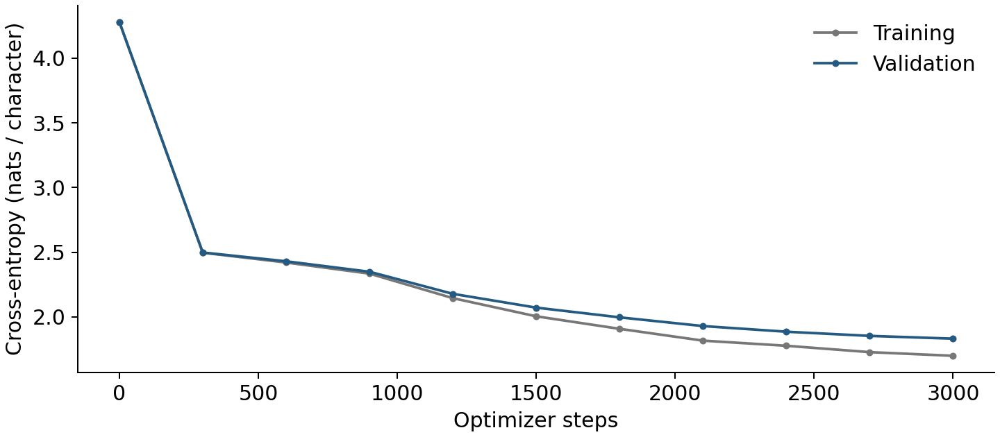
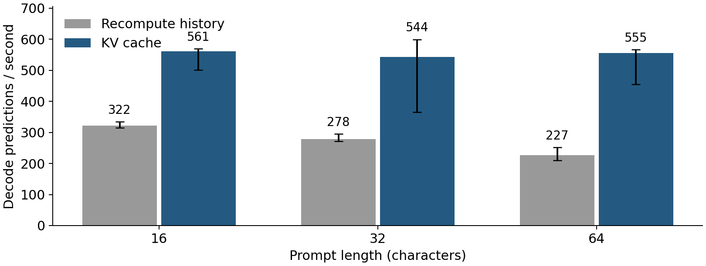

# Understanding KV Caching

A small MSCS2201 Mini Research Problem by Junguang He. Train a character-level
Shakespeare Transformer on CPU, add a KV cache, verify correctness, and measure
the execution time and memory tradeoff.

**Local result:** caching reduced median prefill + decode model execution time by
**1.72–2.40x** across three prompt lengths. The maximum tested absolute logit
difference was **7.15e-6**. Five correctness checks passed, including identical
greedy outputs on the tested prompts. This is one small CPU experiment.

## Presentation and learning material

- [PDF slides](output/pdf/mrp.pdf) - 8 slides for about 10 minutes.
- [Editable slide source](docs/slides.md) - Markdown, with `---` between slides.
- [中文学习笔记](docs/learning_zh.md) - tensor shapes, code walkthrough and exercises.
- [English speaking notes](docs/speaker_notes.md) - a timed outline and likely questions.
- [Reference notes](docs/references.md) - what was used and what to read.

## Run locally

Run commands from the repository root. Python 3.12 was used. A virtual environment
is optional if PyTorch and Matplotlib are already installed. This machine already
had both packages, so no training packages needed to be installed for the run.

```bash
python -m pip install -r requirements.txt
python prepare_data.py
python train.py
python test_cache.py
python benchmark.py
python plot_results.py
python sample.py
```

The data download is about 1.1 MB. Training writes the best validation checkpoint
to `checkpoints/tiny_gpt.pt`. It took **301 seconds for 3,000 steps** on this
Ryzen 5 3500U with four PyTorch threads. This is a measured run, not a runtime
guarantee for every machine. Dataset and checkpoint files are ignored by Git.

Training uses seed 1337, batch 8, AdamW with learning rate 0.0003, and dropout 0.1.
The model has 2 layers, width 128, 4 attention heads and 429,121 parameters.
The first 90% of characters are training data and the last 10% validation data.
Validation loss estimates use the same 20 sampled batches at each evaluation.
The selected checkpoint is step 3,000, with validation cross-entropy **1.8314**.
Language quality is limited and is not the variable tested in the cache experiment.



Try actual generation with greedy decoding:

```bash
python sample.py --prompt 'ROMEO:' --tokens 64 --temperature 0
python sample.py --prompt 'ROMEO:' --tokens 64 --temperature 0 --no-cache
```

The prompt and output together must fit within 128 characters. No sliding-window
or cross-request cache is implemented. [A saved stochastic sample](results/sample.txt)
and [its arguments](results/sample.json) show the trained model's imperfect text.

## Experiment and results

Batch size is 1. The input lengths are 16, 32 and 64 characters, with 64 output
predictions for each configuration. Each round replays one held-out continuation
through both paths. Two warmups per configuration precede five rounds with
shuffled execution order. No training runs concurrently with the benchmark.

**Timing scope:** model forward calls, including cache concatenation, but excluding
model loading, tokenization, sampling, text assembly and file I/O. `total_ms` is
prefill + decode model execution time, not application end-to-end latency.
Prefill predicts the first output character. Decode therefore contains 63 calls.
Both paths calculate the final vocabulary projection only for the last position.

| Prompt chars | Uncached median total | Cached median total | Speedup | Final KV tensors |
| --- | ---: | ---: | ---: | ---: |
| 16 | 198.3 ms | 115.0 ms | 1.72x | 158 KiB |
| 32 | 229.6 ms | 118.9 ms | 1.93x | 190 KiB |
| 64 | 282.1 ms | 117.5 ms | 2.40x | 254 KiB |



Bars show medians, error bars the full observed range. For example, the cached
64-character-prompt workload ranged from 114.7 to 184.9 ms in total execution
time. All runs, including outliers, remain in [benchmark.csv](results/benchmark.csv).
Five runs on a normal desktop do not establish tail latency or statistical
significance. The numerical speedups do not generalize directly to GPUs, larger
models or production serving systems.

At the end, the cache contains `prompt + 63` positions, since the last predicted
character has not been passed back into the model. For FP32 ordinary multi-head
attention, KV bytes equal `2 * layers * batch * cached_positions * width * 4`.
This model uses 2 KiB per cached position at batch 1. The 128-position capacity
corresponds to 256 KiB, while the longest measured request retains 127 positions.
These figures exclude weights, temporary tensors and Python object overhead.
The simple `torch.cat` implementation also copies old cache data each step.

## Code map

| File | Purpose |
| --- | --- |
| `model.py` | Attention, Transformer blocks, positional offsets, KV cache and generation |
| `train.py` | Data split, training, fixed validation windows and checkpoint selection |
| `test_cache.py` | Logit agreement, greedy output, cache size, causality/isolation and boundaries |
| `benchmark.py` | Fixed-continuation replay and raw timing measurements |
| `sample.py` | Actual autoregressive generation from the trained checkpoint |
| `plot_results.py` | Figures from the saved CSV files |
| `render_slides.py` | A small Markdown-to-PDF renderer |

`test_cache.py` uses the trained checkpoint when it exists. Otherwise, it checks a
small randomly initialized model. The saved final [correctness report](results/correctness.json)
identifies the trained checkpoint by SHA-256. Training and benchmark metadata use
the same hash, tying the reported results to the tested weights.

## Rebuild the PDF

```bash
python -m pip install -r requirements-report.txt
python render_slides.py
```

This renders `docs/slides.md` to `output/pdf/mrp.pdf` using ReportLab. The renderer
supports headings, paragraphs, bullets, tables, links, fenced code and images.
It checks that the PDF has exactly one page per Markdown slide. No notebook,
LaTeX installation or browser is needed. Figures remain reproducible from data.

If you rerun training or benchmarks, their default output files are overwritten.
Update numeric text in the slides and this README from the new JSON results before
rendering the PDF again. The measurements supplied here are one recorded run.
Exact timings, and potentially floating-point values, vary across environments.
The recorded versions are Python 3.12.7, PyTorch 2.13.0+cpu and Matplotlib 3.9.2.
The PDF was built with ReportLab 4.4.9 from the bundled document runtime.

## Attribution and scope

The architecture and learning sequence follow [Karpathy's GPT lecture](https://github.com/karpathy/ng-video-lecture).
This project adds an explicit request-local KV cache, correctness checks and a
small CPU experiment. The attention implementation is deliberately elementary.
There is no new attention algorithm, paged cache, scheduler, GPU kernel or claim
to reproduce vLLM's performance. Sources and exact upstream revisions are listed
in [reference notes](docs/references.md).

Codex assisted with implementation, tests, experiments and document preparation.
The author should review the code and practice explaining the experiment before
presenting. The repository includes exercises for that review.

## Review and submission

No commits or pushes were made by the assistant. Suggested review groups:

1. Base model and training: inspect `model.py` and `train.py`, then run a sample.
2. Cache and experiment: inspect the cached path, tests, benchmark and raw results.
3. Documents: review the Markdown, figures and rendered PDF.

After reviewing, commit and push the intended files to this repository. Submit
the GitHub link containing [the PDF](output/pdf/mrp.pdf), as required by the course.
The configured remote is `https://github.com/junguanghe/sofia-ai-final.git` on `main`.
The local files will not be visible on GitHub until you push them.
