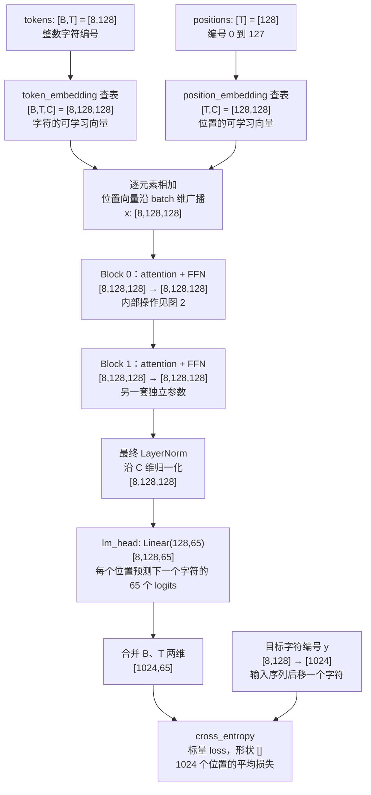
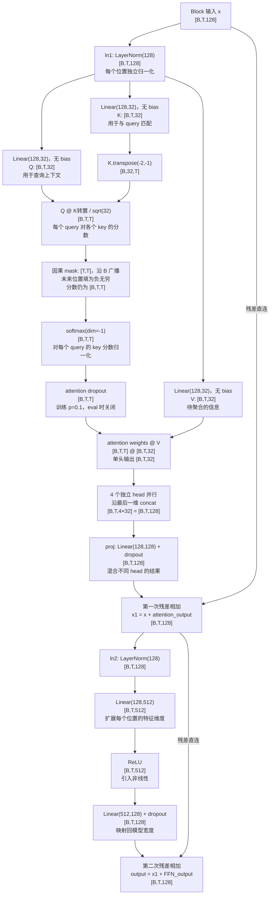
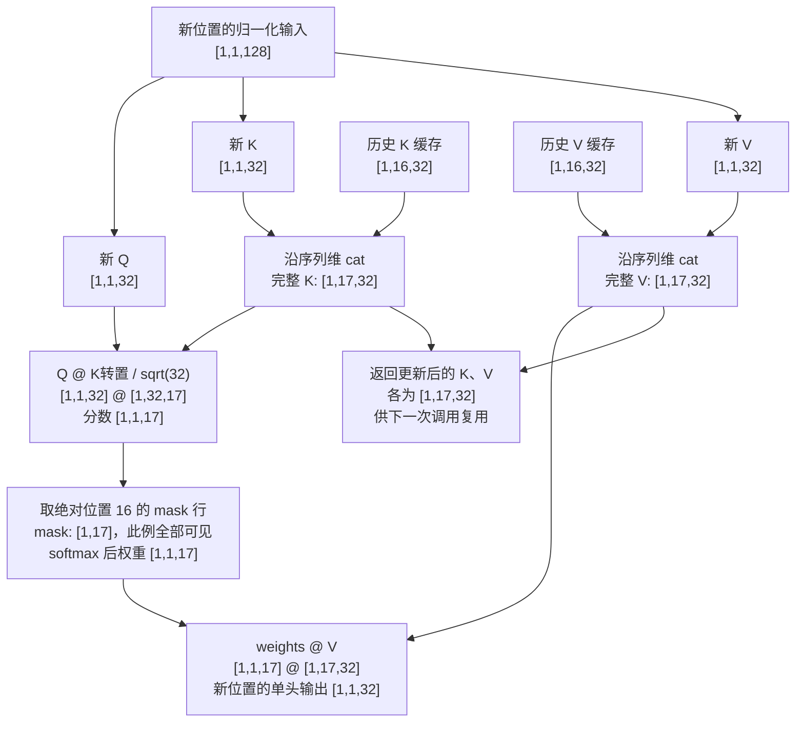

# 本项目 Transformer 的张量流程图

对应 `model.py` 的 `TinyGPT.forward`、`Block.forward`、`Head.forward`。
先看图 1，再把其中一个 Block 展开成图 2。图中的尺寸取自当前项目配置。

## 符号

| 符号 | 含义 | 本项目中的值 |
| --- | --- | --- |
| B | 一次并行处理多少段序列，即 batch size | 训练 8，生成通常 1 |
| T | **本次 forward 输入的 token 数** | 训练 128，缓存 decode 通常 1 |
| C | 每个 token 的隐藏向量维度，即模型宽度 | 128 |
| H | attention head 数量 | 4 |
| d | 单个 head 的向量维度，C / H | 32 |
| V | 字符词表大小 | 65 |
| S | 调用前已经缓存的历史 token 数 | 无缓存时为 0 |
| N | 本次 attention 可见的 K、V 总长度，S + T | 普通 forward 为 T |

**T 和 C 的默认值恰好都是 128，但不是一回事。**
例如 `[8, 128, 128]` 表示 8 段序列，每段 128 个字符，每个字符一个 128 维向量。

## 图 1：整体 forward

这里先看普通训练路径：`use_cache=False, last_only=False`。



- embedding 是**用整数编号查表**，不是把 `[B,T]` 的整数矩阵直接乘 embedding 权重。
- position embedding 的 `[T,C]` 在相加时广播为 `[B,T,C]`，同一个位置编号使用同一条位置向量。
- `TinyGPT.forward` 返回 logits；图中的 flatten 和 loss 在 `train.py` 中执行。
- logits 是分数，还不是概率。`cross_entropy` 内部处理 log-softmax，不需要先手动 softmax。

## 图 2：展开一个 Block

两个 Block 结构相同，参数互不共享。以下仍为普通训练路径，单个 head 的 `d=32`。



这里的 Q/K/V 分支画的是**一个 head**，代码中有 4 套独立的 Q/K/V 权重。
训练时 `[B,T,T]` 是 `[8,128,128]`；它的两个 128 都表示位置数量，分别是 query 位置和 key 位置，**不含 embedding 维度**。

attention 会跨位置混合信息。Linear、LayerNorm、ReLU 都分别作用于每个位置的向量，不把不同 batch 样本混在一起。
softmax 后每行权重和为 1；训练时紧接着的 dropout 可能改变这一性质。评估时 dropout 不做修改。

## 图 3：KV cache 改变了哪些张量？

例子：prefill 已处理 16 个字符，现在送入第 17 个字符。
因此 `B=1, S=16, T=1, N=17`。下图仍只画一个层、一个 head。



每层每个 head 都有自己的缓存，代码结构为 `cache[layer][head] = (K, V)`。
这是 Python 的嵌套列表与元组，**不是一个统一的六维张量**。
decode 只计算新位置，历史 Q 不再需要；历史 K、V 仍然参与 attention。

| 操作/张量 | 普通训练 | prefill，输入 16 个字符 | decode，已有 16 个字符缓存 |
| --- | --- | --- | --- |
| 输入 tokens | `[8,128]` | `[1,16]` | `[1,1]` |
| positions 的值 | `0…127` | `0…15` | `[16]` |
| embedding 相加 | `[8,128,128]` | `[1,16,128]` | `[1,1,128]` |
| 每个 head 的新 Q | `[8,128,32]` | `[1,16,32]` | `[1,1,32]` |
| 每个 head 的完整 K、V | 各 `[8,128,32]` | 各 `[1,16,32]` | 各 `[1,17,32]` |
| attention 分数 | `[8,128,128]` | `[1,16,16]` | `[1,1,17]` |
| 4 头拼接/Block 输出 | `[8,128,128]` | `[1,16,128]` | `[1,1,128]` |
| FFN 内部扩展维度 | `[8,128,512]` | `[1,16,512]` | `[1,1,512]` |
| 全部 Block 之后的切片 | 不切片 | `x[:, -1:]` → `[1,1,128]` | `x[:, -1:]` → `[1,1,128]` |
| 最终 LayerNorm | `[8,128,128]` | `[1,1,128]` | `[1,1,128]` |
| lm_head 输出 logits | `[8,128,65]` | `[1,1,65]` | `[1,1,65]` |

生成时 `generate()` 使用 `last_only=True`。切片发生在**所有 Block 之后**，所以无缓存版本仍会在 Block 内重新计算历史位置。

## logits 后面如何选字符？

```text
logits                         [B,1,65]
logits[:, -1]                  [B,65]
greedy: argmax(keepdim=True)    [B,1]   一个新字符的整数编号
或 softmax + multinomial       [B,1]   按概率采样一个编号
与已有 tokens 沿 dim=1 拼接     [B,已有长度+1]
```

argmax 和采样是 `generate()` 的操作，不属于 `TinyGPT.forward`。
prefill 的输出预测第一个新字符；decode 输入这个新字符，再预测下一个。

## 可学习权重的矩阵尺寸

以下采用 **PyTorch 实际存储形状**。`Linear(in,out)` 计算 `x @ weight.T + bias`，因此 weight 存为 `[out,in]`。

| 模块 | weight 形状 | bias 形状 |
| --- | --- | --- |
| token_embedding | `[65,128]` | 无 |
| position_embedding | `[128,128]` | 无 |
| 每个 head 的 query/key/value，各一份 | 各 `[32,128]` | 无 |
| 每个 Block 的 proj | `[128,128]` | `[128]` |
| 每个 Block 的 FFN 第一层 | `[512,128]` | `[512]` |
| 每个 Block 的 FFN 第二层 | `[128,512]` | `[128]` |
| 每个 LayerNorm | 缩放参数 `[128]` | 平移参数 `[128]` |
| 最终 lm_head | `[65,128]` | `[65]` |

LayerNorm 的参数是向量，不做权重矩阵乘法。token embedding 和 lm_head 虽然形状相同，本项目没有共享它们的权重。

这些形状已用当前模型实际运行核对：训练 logits `[8,128,65]`，prefill/decode logits `[1,1,65]`，单头缓存从 `[1,16,32]` 扩展到 `[1,17,32]`。
